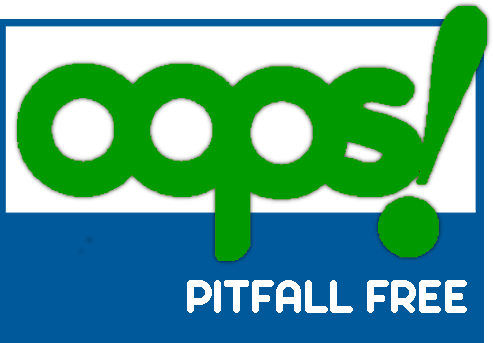

# ProgettoModSem2023

Questa repo contiene l'ontologia OntoGames relativa al mondo dei videogiochi.

Fatta in collaborazione da **Andrea Cacioli** e **Samuele Cavagnino**.

Qui un [link](./LodeExtract.html) alla documentazione generata automaticamente con [LODE](http://www.essepuntato.it/lode): un tool che descrive le ontologie.

## Files

In questa repo si trovano:

- Tre Ontologie (Una RDF inferita, una TTL Asserita, una RDF Asserita)
- Una applicazione web
- File di documentazione

## Motivazioni

Come indicato in precedenza questa ontologia é stata pensata per il mondo dei videogiochi e serve a rappresentare sia il concetto di videogioco come prodotto vendibile, sia come ambientazione di eventi immaginari.

Tale ontologia renderá possibile accedere ai dati in maniera semplice per via della sua natura a grafo, per cui informazioni collegate fra loro saranno di facile accesso.

### Sitografia

Per popolare l'ontologia con una A-Box reale sono state usate diverse fonti:

- Wikidata
- Fandom Wiki
- Steam DB

---

## Requisiti

La finalitá generale dell'ontologia é quella di accesso ai dati da parte di utenti che non necessariamente devono conoscere il dominio.
Un utente inesperto, infatti, potrebbe voler trovare delle informazione su un gioco in vista di un possibile acquisto e per farlo vorrebbe poter cercare tra i generi e tra i personaggi.
Inoltre potrebbe essere interessato a giochi di un certo studio a cui potrebbe essere affezionato.
Oppure potrebbe anche voler sapere quali sono i giochi in una certa saga che ha iniziato e non sa come proseguire.

## Descrizione Dominio

Il dominio videoludico é un dominio vastissimo, per cui permette di avere numerose interpretazioni. Infatti la nostra scelta non é affatto l'unica plausibile, tuttavia ci é sembrata una scelta ragionevole in quanto modella facilmente la doppia natura del videogioco:

- Il videogioco come prodotto vendibile
- Il videogioco come ambientazione di storie

Esistono inoltre giochi che non hanno la mira di racconatare una storia, invece sono pensati per mettere alla prova il talento dei giocatori e per permettere ad essi di sfidarsi in competizioni.

Inoltre la "fanbase" di un videogioco potrebbe interessarsi ai cosí detti spin-off: una apparizione di un personaggio di un videogioco anche in altri videogiochi. Ció é importante che sia rappresentato nella nostra ontologia.

## Competency Questions

L'ontologia puó "rispondere" a numerose domande, qui ne riportiamo alcune:

- Qual é il titolo dei videogiochi che appartengono ad una saga?
- Di che saga fa parte un videogioco?
- Qual é lo studio di un videogioco?
- Quanti sono i videogiochi di una particolare saga?
- Qual é la data di fondazione di uno studio?
- Qual é il protagonista di un certo videogioco?
- Qual é l'ordine cronologico dei videogiochi di una saga?
- Tutti i titoli con protagonista femminile.
- Tutti i titoli con storie d'amore contraccambiate.

---

## Documentazione

---

## Visualizzazione

