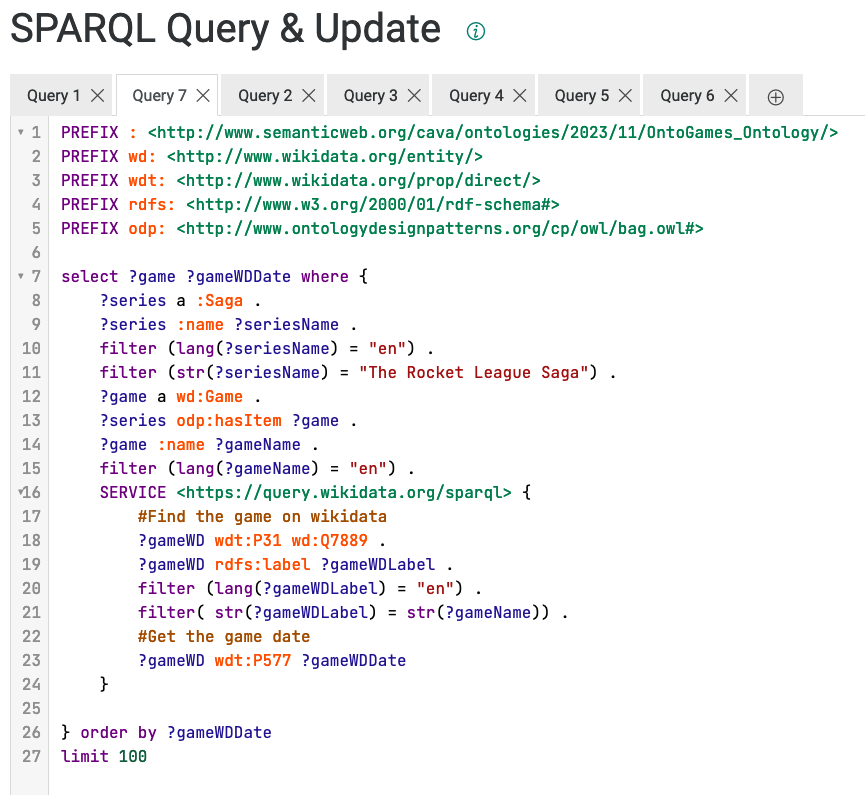

# ProgettoModSem2023


Questa repo contiene l'ontologia OntoGames relativa al mondo dei videogiochi.

Fatta in collaborazione da **Andrea Cacioli** e **Samuele Cavagnino**.

Qui un [link](./LodeExtract.html) alla documentazione generata automaticamente con [LODE](http://www.essepuntato.it/lode): un tool che descrive le ontologie.

## Files

In questa repo si trovano:

- Tre Ontologie (Una RDF inferita, una TTL Asserita, una RDF Asserita)
- Una applicazione web
- File di documentazione

## Motivazioni

Come indicato in precedenza questa ontologia é stata pensata per il mondo dei videogiochi e serve a rappresentare sia il concetto di videogioco come prodotto vendibile, sia come ambientazione di eventi immaginari.

Tale ontologia renderá possibile accedere ai dati in maniera semplice per via della sua natura a grafo, per cui informazioni collegate fra loro saranno di facile accesso.

### Sitografia

Per popolare l'ontologia con una A-Box reale sono state usate diverse fonti:

- Wikidata
- Fandom Wiki
- Steam DB

---

## Requisiti

La finalitá generale dell'ontologia é quella di accesso ai dati da parte di utenti che non necessariamente devono conoscere il dominio.
Un utente inesperto, infatti, potrebbe voler trovare delle informazione su un gioco in vista di un possibile acquisto e per farlo vorrebbe poter cercare tra i generi e tra i personaggi.
Inoltre potrebbe essere interessato a giochi di un certo studio a cui potrebbe essere affezionato.
Oppure potrebbe anche voler sapere quali sono i giochi in una certa saga che ha iniziato e non sa come proseguire.

## Descrizione Dominio

Il dominio videoludico é un dominio vastissimo, per cui permette di avere numerose interpretazioni. Infatti la nostra scelta non é affatto l'unica plausibile, tuttavia ci é sembrata una scelta ragionevole in quanto modella facilmente la doppia natura del videogioco:

- Il videogioco come prodotto vendibile
- Il videogioco come ambientazione di storie

Esistono inoltre giochi che non hanno la mira di racconatare una storia, invece sono pensati per mettere alla prova il talento dei giocatori e per permettere ad essi di sfidarsi in competizioni.

Inoltre la "fanbase" di un videogioco potrebbe interessarsi ai cosí detti spin-off: una apparizione di un personaggio di un videogioco anche in altri videogiochi. Ció é importante che sia rappresentato nella nostra ontologia.

## Competency Questions

L'ontologia puó "rispondere" a numerose domande, qui ne riportiamo alcune:

- Qual é il titolo dei videogiochi che appartengono ad una saga?
- Di che saga fa parte un videogioco?
- Qual é lo studio di un videogioco?
- Quanti sono i videogiochi di una particolare saga?
- Qual é la data di fondazione di uno studio?
- Qual é il protagonista di un certo videogioco?
- Qual é l'ordine cronologico dei videogiochi di una saga?
- Tutti i titoli con protagonista femminile.
- Tutti i titoli con storie d'amore contraccambiate.

---

## Documentazione

Per questo progetto ci siamo posti il problema di rappresentare il videogioco partendo dalle varie fonti giá presenti sulla rete. In particolare abbiamo utilizzato:

- **SteamDB**
    Un database in cui é possibile trovare informazioni sul gioco visto come prodotto: le copie vendute, gli utenti online che stanno giocando ad un qualche gioco, il costo di un gioco, il suo indice di gradimento, le piattaforme supportate, i developer e molto altro ancora.
    Qui sotto si possono vedere delle immagini della pagina principale di questo sito e della pagina del videogioco "Cyberpunk 2077".

    

    

- **Wiki Fandom**
    Wiki Fandom é un sito che permette a tutti i fan di qualcosa di creare le proprie wiki in cui raccogliere le informazioni relative alla loro passione.
    In particolare sono presenti numerose wiki su videogiochi, film e libri. Tale sito é una risorsa importante per tutti i giochi con una storia visti come ambientazione di eventi e, appunto, come storie.
    Qui di seguito abbiamo riportato la pagina del videogioco "Martha is Dead" presa da Wiki Fandom.

    

- **Steam**
    Steam é il principale marketplace per la vendita di videogiochi su PC ed in quanto tale ha delle pagine per ogni videogioco. In tali pagine si possono vedere le categorie a cui il videogioco appartiene. Durante la modellazione delle classi e per alcune regole SWRL, questo strumento ci ha permesso di trovare ulteriori categorizzazioni che si possono dare ai videogiochi. Ad esempio RPG o Female Protagonist.
    Qui di seguito una foto della pagina del videogioco "Martha is Dead" nella sezione categorie.

    

---

## Visualizzazione

Tassonomia:


A-Box:


Esempio Triple da sezione [Descrizione Dominio](#descrizione-dominio).

### Esempio videogioco come prodotto vendibile

| soggetto      | predicato | oggetto       |
| ------------- | --------- | ------------- |
| Rocket League | madeBy    | Psyonix       |
| Rocket Racing | madeBy    | Psyonix       |
| Octane        | assetOf   | Rocket League |
| Aquadome      | mapOf     | Rocket League |

### Esempio videogioco come ambientazione di una storia

| soggetto | predicato     | oggetto        |
| -------- | ------------- | -------------- |
| Martha   | appearsIn     | Martha Is Dead |
| Giulia   | appearsIn     | Martha Is Dead |
| Giulia   | protagonistOf | Martha Is Dead |
| Lapo     | loves         | Giulia         |
| Giulia   | loves         | Lapo           |

## Interazione Utente

---

## SPARQL Queries

É riportata qua sotto una lista delle query che sono state sviluppate.

1) Qual é il titolo dei videogiochi che appartengono ad una saga?

    

    Per ogni videogioco che appartiene ad una qualche saga, lo si estrae e si restituisce il nome in inglese.
2) Di che saga fa parte un videogioco?

    

    Si parte dal nome di un videogioco e si trova la saga di appartenenza di tale videogioco.
    In questo esempio é mostrato il gioco FIFA 2020.
3) Qual é lo studio di un videogioco?

    

    Si parte dal nome di un videogioco e si trova il nome dello studio che lo ha creato.
    Nell'esempio la lingua di ritorno é quella italiana
4) Quanti sono i videogiochi di una particolare saga?

    

    Si parte dal nome di una saga e si restituisce il COUNT dei titoli che ne fanno parte.
5) Qual é la data di fondazione di uno studio?

    

    

    Si parte dal nome di uno studio e si fa la query federata per trovare uno "studio di wikidata" e se ne estrae la data di fondazione.
6) Qual é il protagonista di un certo videogioco?

    

    Si parte dal nome di un videogioco e si trova un personaggio che é protagonista del gioco stesso.
7) Qual é l'ordine cronologico dei videogiochi di una saga?

    

    

    Si parte dal nome di una saga, si prendono tutti i suoi giochi e per ognuno di essi si trova la data di pubblicazione in maniera federata da wikidata e la si restituisce insieme al gioco stesso.
8) Tutti i titoli con protagonista femminile.

    

    Si restituiscono tutti i titoli con protagonista femminile.
9) Tutti i titoli con storie d'amore contraccambiate.

    

    Si trovano tutti i personaggi che si amano a vicenda e si restituisce il gioco in cui entrambi compaiono.

## Estensioni

### Applicazione Client

L'applicazione client é nella cartella 'OntoGames-frontend' e la si puó eseguire in locale coi seguenti comandi.

#### Dipendenze

- NodeJs (npm)
- GraphDb

#### Far partire in locale

```bash
npm install
npm start
```

Il frontend sará disponibile alla porta :4200 (porta base di Angular)
Il frontend per poter funzionare ha bisogno di GraphDb.
Questo puó essere installato in locale oppure tramite Docker. Il docker file é nella root folder della repo.

Semplicemente, per far partire GraphDb:

```bash
docker compose up -d
```

e

```bash
docker compose down
```

per fermarlo.

La GUI di GraphDb sará disponibile alla porta :7200 (porta base di GraphDb)

### Regole SWRL

Abbiamo creato 5 regole SWRL per definire concetti di supporto per l'ontologia:

1) Adult: Un personaggio di etá maggiore di 18 anni

    ```SWRL
    Character(?c) ^ age(?c, ?cage) ^ swrlb:greaterThanOrEqual(?cage, 18) -> Adult(?c)
    ```

2) Card Game: Un gioco che permetto di fare partite di carte.

    ```SWRL
     autogen0:Game(?g) ^ Card(?c) ^ isAssetOf(?c, ?g) -> Card_Game(?g)
    ```

3) Minor: Un personaggio di etá minore di 18 anni

    ```SWRL
    Character(?c) ^ age(?c, ?cage) ^ swrlb:lessThan(?cage, 18) -> Minor(?c)
    ```

4) MutuallyLoves: Relazione tra personaggi che si amano a vicenda.

    ```SWRL
    loves(?x, ?z) ^ loves(?z, ?x) -> mutuallyLoves(?x, ?z)
    ```

5) RPG: (Role Playing Game) Un gioco di ruolo in cui ci sono personaggi non umani

    ```SWRL
    autogen0:Game(?g) ^ Character(?c) ^ appearsIn(?c, ?g) ^ class(?c, ?cclass) ^ swrlb:notEqual(?cclass, "Human") -> RPG(?g) 
    ```
